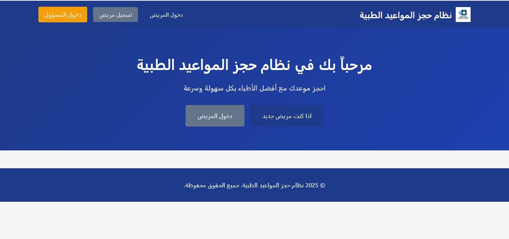
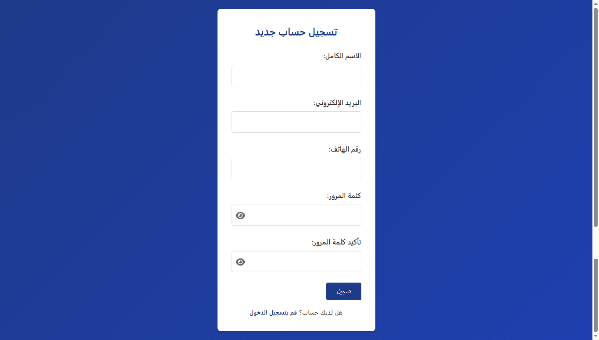
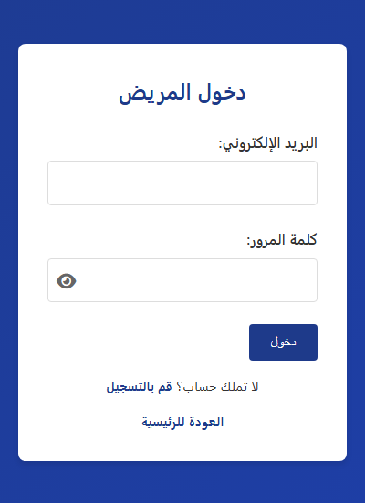
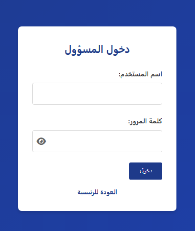

# Appointment Booking System

A comprehensive and user-friendly **Appointment Booking System** developed using PHP, MySQL, HTML, CSS, and JavaScript. This system facilitates seamless scheduling and management of appointments for both patients and administrative staff.

## 🌟 Features

*   **Patient Module:**
    *   Patient registration and login.
    *   Book new appointments with available doctors.
    *   View and manage (cancel) their scheduled appointments.
*   **Admin Module:**
    *   Secure admin login.
    *   Dashboard for an overview of the system.
    *   Manage doctors (add, edit, delete).
    *   Manage patients (view, edit, delete).
    *   Manage appointments (view, approve, cancel).
*   **Database Management:**
    *   Structured MySQL database schema for efficient data handling.
    *   Clear separation of concerns for easy maintenance.

## 🛠️ Technologies Used

| Technology | Type | Description |
| :--- | :--- | :--- |
| **PHP** | Backend | Server-side scripting for logic and database interaction. |
| **MySQL** | Database | Relational database management system for data storage. |
| **HTML5** | Frontend | Structure of the web pages. |
| **CSS3** | Frontend | Styling and visual presentation. |
| **JavaScript** | Frontend | Client-side interactivity and dynamic content. |

## 🚀 Installation and Setup

Follow these steps to get the project running on your local machine:

1.  **Clone the Repository:**
    Since you are setting up the repository for the first time, you will download the files and then initialize Git.

2.  **Database Setup:**
    *   Create a new database named `appointment_booking_system` in your MySQL server (e.g., using phpMyAdmin).
    *   Import the schema using the provided SQL script: `database/appointment_booking_system.sql`. This file contains only the table structures (schema) and no sample data.

3.  **Configuration:**
    *   Open the configuration file: `config/db.php`.
    *   Update the database connection details (`DB_SERVER`, `DB_USERNAME`, `DB_PASSWORD`, `DB_NAME`) to match your local environment.

4.  **Access the System:**
    *   Place the project folder in your web server's root directory (e.g., `htdocs` for XAMPP or `www` for WAMP).
    *   Access the system through your browser: `http://localhost/appointment_system/`.

## 📸 Screenshots

Here are some screenshots of the system's user interface:

### Login/Registration Interface

### Patient Dashboard

### Appointment Booking

### Admin Panel - Manage Appointments

## 👤 Author

This project was developed and maintained by:

| Role | Name | GitHub Profile |
| :--- | :--- | :--- |
| **Developer** | Eng-Akil-Alsufi | [https://github.com/Eng-Akil-Alsufi](https://github.com/Eng-Akil-Alsufi) |

---
